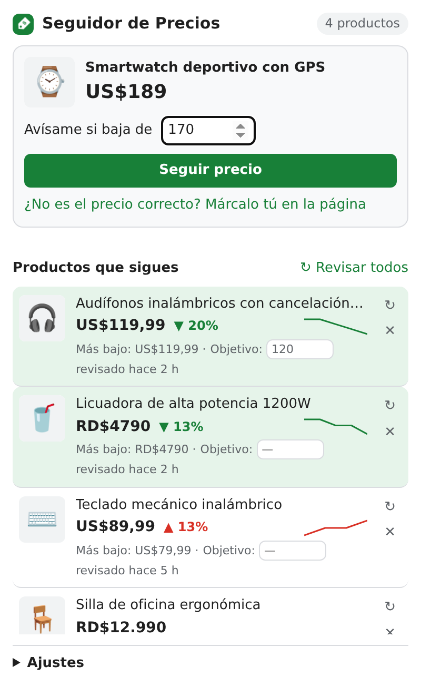

# Seguidor de Precios

Extensión de Chrome que sigue el precio de cualquier producto en cualquier tienda online y te avisa cuando baja o cuando llega al precio que quieres pagar.

### [⬇️ Descargar la extensión (.zip)](https://github.com/juanabraham8091/seguidor-precios/raw/main/seguidor-precios.zip)

## Instalación (2 minutos)

1. **Descarga** el archivo con el enlace de arriba.
2. **Descomprímelo.** Obtendrás una carpeta llamada `seguidor-precios`.
3. En Chrome, escribe `chrome://extensions` en la barra de direcciones y pulsa Enter.
4. Activa el **Modo de desarrollador** (interruptor arriba a la derecha).
5. Pulsa **Cargar descomprimida** y selecciona la carpeta `seguidor-precios`, la que contiene el archivo `manifest.json`.
6. Pulsa el icono de la pieza de puzle 🧩 junto a la barra de direcciones y fija **Seguidor de Precios** para tenerla siempre a mano.

Funciona también en Edge, Brave y otros navegadores basados en Chromium.

## Cómo se usa

1. Abre la página de un producto en cualquier tienda (Amazon, eBay, MercadoLibre, tiendas con Shopify o WooCommerce, etc.).
2. Pulsa el icono de la extensión. Verás el producto con su precio actual.
3. Si quieres, escribe un **precio objetivo** ("Avísame si baja de…").
4. Pulsa **Seguir precio**. La primera vez en cada tienda, Chrome te pedirá permiso para que la extensión pueda revisar esa página.

Si la extensión no encuentra el precio sola, pulsa **Marcar el precio en la página** y haz clic sobre el precio. Desde entonces lo leerá siempre de ese lugar.

## Funciones

- **Detección automática del precio** usando los datos que publican las tiendas (schema.org, Open Graph, microdatos) y selectores de tiendas conocidas como Amazon y eBay.
- **Marcar el precio a mano** con un clic, para las tiendas donde no se detecta solo.
- **Revisión en segundo plano** cada 1, 3, 6, 12 o 24 horas, mientras el navegador está abierto.
- **Avisos** de Chrome cuando un precio baja o llega a tu precio objetivo. Al pulsar el aviso se abre el producto.
- **Lista de productos** con precio actual, cambio desde que empezaste a seguirlo (▼ / ▲ %), precio más bajo visto, mini gráfico del historial y precio objetivo editable.
- **Insignia en el icono** con el número de productos que bajaron desde la última vez que abriste la extensión.
- **Monedas**: reconoce formatos como `RD$ 1,299.00`, `$1.299,50` o `49,99 €`.

## Permisos

| Permiso | Para qué se usa |
|---|---|
| Acceso a la tienda (se pide sitio por sitio) | Volver a visitar la página del producto para leer el precio |
| `activeTab`, `scripting` | Leer el precio de la página que tienes abierta cuando pulsas el icono |
| `storage` | Guardar tus productos y ajustes en el navegador |
| `alarms` | Revisar los precios cada cierto tiempo |
| `notifications` | Avisarte cuando baja un precio |
| `offscreen` | Analizar el HTML de las páginas descargadas |

## Privacidad

Todo se guarda en tu navegador (`chrome.storage.local`). La extensión no tiene servidor propio y no envía tus datos a ningún sitio: solo visita las páginas de los productos que sigues.

Política de privacidad completa: [PRIVACIDAD.md](PRIVACIDAD.md).

## Limitaciones

- Las revisiones automáticas solo ocurren con el navegador abierto.
- Algunas tiendas cargan el precio con JavaScript después de abrir la página, o bloquean las visitas automáticas. En esos casos la extensión muestra el error en la lista en lugar de inventar un precio.

## Detalles técnicos

Hecha con Manifest V3 y JavaScript puro, sin dependencias ni paso de compilación.

| Archivo | Qué hace |
|---|---|
| `manifest.json` | Configuración y permisos |
| `extractor.js` | Lee el producto y el precio de una página: datos estructurados, metaetiquetas y selectores |
| `store.js` | Productos, historial de precios y ajustes guardados |
| `background.js` | Service worker: revisiones periódicas, avisos e insignia |
| `offscreen.html` / `offscreen.js` | Analiza con `DOMParser` el HTML que descarga el service worker |
| `picker.js` | Modo "marcar el precio" que se inyecta en la página |
| `popup.html` / `popup.css` / `popup.js` | Ventana de la extensión, con modo claro y oscuro |
| `icons/` | Iconos de la extensión |
